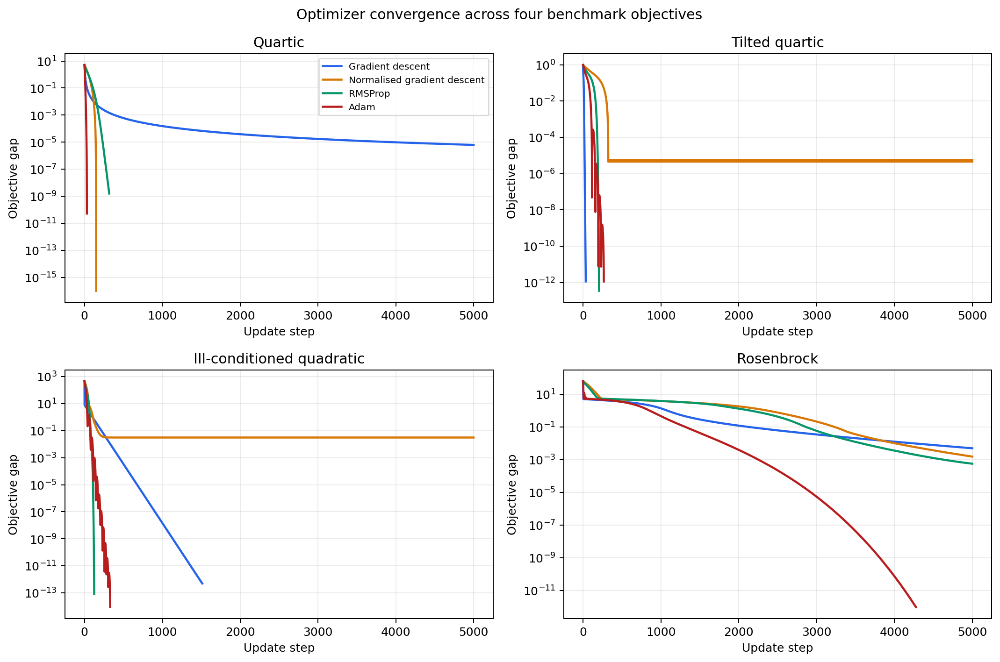
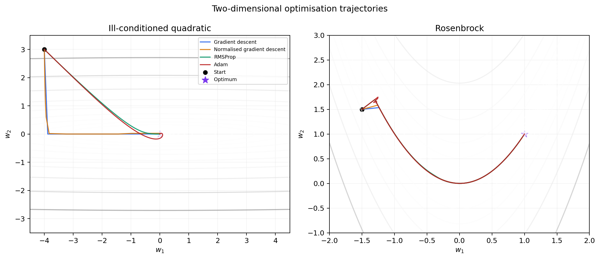
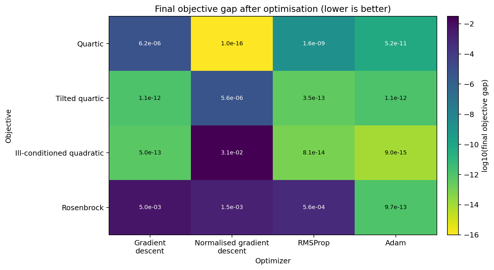

# Gradient Descent Optimizer Comparison from Scratch

This project implements and compares four first-order optimisation algorithms using NumPy:

- standard gradient descent;
- L2-normalised gradient descent;
- RMSProp;
- Adam with first- and second-moment bias correction.

The algorithms are evaluated on four deterministic objectives ranging from simple one-dimensional polynomials to the curved Rosenbrock valley. Every optimiser records its complete parameter, objective-value, and gradient-norm history. The program then writes machine-readable results and produces convergence, trajectory, and final-performance plots.

The implementation is intended to make each update rule inspectable. It does not rely on a machine-learning framework or automatic differentiation.

## Main Aim

The project demonstrates how different first-order update rules respond to:

- flat gradients near a minimum;
- fixed-length normalised steps;
- strongly different curvature across coordinates;
- a narrow, curved optimisation valley;
- exponential first- and second-moment estimates;
- a finite update budget and explicit convergence tolerance.

The comparison is designed as an educational numerical experiment. It shows characteristic behaviour under documented settings rather than claiming that one optimiser is universally superior.

## What the Code Does

For every benchmark objective, the program:

1. loads its analytical value and gradient functions;
2. verifies the expected point dimension;
3. starts all optimisers from the same objective-specific initial point;
4. applies a documented learning rate for each optimiser;
5. records the parameter vector before and after every update;
6. records the objective value and gradient norm at every step;
7. stops when the gradient norm reaches the tolerance or the update budget is exhausted;
8. calculates the final objective gap and distance to the known minimiser;
9. writes JSON, summary CSV, and full convergence-history CSV files;
10. produces comparison and trajectory figures;
11. prints a compact terminal summary.

The default experiment is deterministic and does not use random initialisation.

## Optimisation Algorithms

Let

```math
\mathbf{g}_t=\nabla f(\mathbf{w}_{t-1})
```

be the gradient evaluated before update $t$, and let $\eta$ denote the learning rate.

### Standard gradient descent

Standard gradient descent uses the raw gradient:

```math
\mathbf{w}_t
=
\mathbf{w}_{t-1}
-
\eta\mathbf{g}_t.
```

The gradient magnitude therefore controls the update length. This can produce fast movement where the objective is steep and slow progress in flat regions.

### Normalised gradient descent

The normalised method divides the gradient by its global L2 norm:

```math
\mathbf{d}_t
=
\frac{\mathbf{g}_t}
{\max\!\left(\lVert\mathbf{g}_t\rVert_2,\epsilon\right)},
```

and updates using

```math
\mathbf{w}_t
=
\mathbf{w}_{t-1}
-
\eta\mathbf{d}_t.
```

When the gradient is not close to zero, every update has length approximately $\eta$. This avoids very small steps on flat objectives, but a fixed step length can overshoot or oscillate around a minimum.

This implementation uses one global L2 norm. It is different from independently replacing each coordinate by its sign.

### RMSProp

RMSProp maintains an exponential moving average of squared gradients:

```math
\mathbf{s}_t
=
\rho\mathbf{s}_{t-1}
+
(1-\rho)\mathbf{g}_t\odot\mathbf{g}_t,
```

where $\odot$ denotes elementwise multiplication.

The update is

```math
\mathbf{w}_t
=
\mathbf{w}_{t-1}
-
\eta
\frac{\mathbf{g}_t}
{\sqrt{\mathbf{s}_t}+\epsilon}.
```

Coordinates with consistently large squared gradients receive smaller effective steps. This is useful when the objective has very different curvature in different directions.

The reference run uses

```math
\rho=0.9.
```

### Adam

Adam combines exponential moving averages of the gradient and squared gradient:

```math
\mathbf{m}_t
=
\beta_1\mathbf{m}_{t-1}
+
(1-\beta_1)\mathbf{g}_t,
```

```math
\mathbf{v}_t
=
\beta_2\mathbf{v}_{t-1}
+
(1-\beta_2)\mathbf{g}_t\odot\mathbf{g}_t.
```

Both accumulators start at zero, so the implementation applies the standard bias corrections:

```math
\widehat{\mathbf{m}}_t
=
\frac{\mathbf{m}_t}{1-\beta_1^t},
\qquad
\widehat{\mathbf{v}}_t
=
\frac{\mathbf{v}_t}{1-\beta_2^t}.
```

The corrected update is

```math
\mathbf{w}_t
=
\mathbf{w}_{t-1}
-
\eta
\frac{\widehat{\mathbf{m}}_t}
{\sqrt{\widehat{\mathbf{v}}_t}+\epsilon}.
```

The reference settings are

```math
\beta_1=0.9,
\qquad
\beta_2=0.999,
\qquad
\epsilon=10^{-8}.
```

The first-update unit test specifically verifies that the Adam update is bias corrected.

## Benchmark Objectives

The suite contains two scalar objectives and two two-dimensional objectives.

### Quartic

The first objective is

```math
f(w)=w^4.
```

Its gradient is

```math
f'(w)=4w^3.
```

The global minimiser and minimum are

```math
w_\star=0,
\qquad
f(w_\star)=0.
```

The initial point is

```math
w_0=-1.5.
```

This objective becomes very flat near zero, so standard gradient descent makes progressively smaller updates.

### Tilted quartic

The second objective preserves the polynomial used in the original gradient-descent exercise:

```math
f(w)
=
\frac{w^4+w^2+10w}{50}.
```

Its gradient is

```math
f'(w)
=
\frac{4w^3+2w+10}{50}.
```

The numerical minimiser is

```math
w_\star
\approx
-1.2347728251,
```

with

```math
f(w_\star)
\approx
-0.1699692845.
```

The initial point is $w_0=2$.

### Ill-conditioned quadratic

The anisotropic quadratic is

```math
f(w_1,w_2)
=
\frac12\left(w_1^2+100w_2^2\right).
```

Its gradient is

```math
\nabla f
=
\begin{bmatrix}
w_1\\
100w_2
\end{bmatrix}.
```

The factor of 100 creates much steeper curvature in the $w_2$ direction than in the $w_1$ direction. The known minimiser is $(0,0)$ and the starting point is $(-4,3)$.

### Rosenbrock

The Rosenbrock objective is

```math
f(w_1,w_2)
=
(1-w_1)^2
+
100\left(w_2-w_1^2\right)^2.
```

Its minimiser is

```math
\mathbf{w}_\star=(1,1),
\qquad
f(\mathbf{w}_\star)=0.
```

The reference run begins at

```math
\mathbf{w}_0=(-1.5,1.5).
```

The curved valley makes the objective a useful test of whether an optimiser can combine progress along a shallow direction with stability across a steep direction.

## Experimental Design

### Convergence rule

An optimiser is marked as converged when

```math
\left\lVert\nabla f(\mathbf{w}_t)\right\rVert_2
\leq
10^{-6}.
```

If this condition is not reached, the run stops after 5,000 updates and is reported as `maximum_steps`.

The objective gap is calculated as

```math
\max\!\left(f(\mathbf{w}_t)-f(\mathbf{w}_\star),0\right).
```

The zero clamp prevents insignificant negative round-off values when a computed result is numerically indistinguishable from the known minimum.

### Learning rates

One learning rate is documented for each optimiser-objective pair:

| Objective | Gradient descent | Normalised gradient descent | RMSProp | Adam |
|---|---:|---:|---:|---:|
| Quartic | `0.01` | `0.01` | `0.01` | `0.1` |
| Tilted quartic | `1.0` | `0.01` | `0.02` | `0.05` |
| Ill-conditioned quadratic | `0.01` | `0.05` | `0.05` | `0.1` |
| Rosenbrock | `0.001` | `0.001` | `0.001` | `0.03` |

Using one universal learning rate would confound the update rule with objective scale and stability. These values provide stable, interpretable trajectories, but they are not the result of an exhaustive hyperparameter search.

Consequently, the results compare the documented runs rather than establish a learning-rate-independent ranking.

## Reference Results

The following results were generated with the default 5,000-update budget and gradient-norm tolerance of `1e-6`.

| Objective | Optimiser | Steps | Converged | Final objective gap | Final gradient norm |
|---|---|---:|:---:|---:|---:|
| Quartic | Gradient descent | 5000 | No | `6.223e-06` | `4.984e-04` |
| Quartic | Normalised gradient descent | 150 | Yes | `2.053e-60` | `6.860e-45` |
| Quartic | RMSProp | 318 | Yes | `1.561e-09` | `9.934e-07` |
| Quartic | Adam | 31 | Yes | `5.212e-11` | `7.759e-08` |
| Tilted quartic | Gradient descent | 34 | Yes | `1.144e-12` | `9.638e-07` |
| Tilted quartic | Normalised gradient descent | 5000 | No | `5.560e-06` | `2.130e-03` |
| Tilted quartic | RMSProp | 205 | Yes | `3.460e-13` | `5.300e-07` |
| Tilted quartic | Adam | 266 | Yes | `1.142e-12` | `9.631e-07` |
| Ill-conditioned quadratic | Gradient descent | 1513 | Yes | `4.957e-13` | `9.957e-07` |
| Ill-conditioned quadratic | Normalised gradient descent | 5000 | No | `3.125e-02` | `2.500e+00` |
| Ill-conditioned quadratic | RMSProp | 125 | Yes | `8.139e-14` | `4.035e-07` |
| Ill-conditioned quadratic | Adam | 330 | Yes | `8.987e-15` | `2.195e-07` |
| Rosenbrock | Gradient descent | 5000 | No | `4.951e-03` | `6.660e-02` |
| Rosenbrock | Normalised gradient descent | 5000 | No | `1.532e-03` | `4.713e-01` |
| Rosenbrock | RMSProp | 5000 | No | `5.648e-04` | `6.482e-01` |
| Rosenbrock | Adam | 4276 | Yes | `9.695e-13` | `9.957e-07` |

Complete unrounded values are stored in:

- [`results/default_summary.json`](results/default_summary.json);
- [`results/default_summary.csv`](results/default_summary.csv).

## Interpretation

### Quartic behaviour

Standard gradient descent reduces the objective steadily but does not satisfy the gradient tolerance within 5,000 updates because the quartic gradient becomes very small near zero.

Normalised descent reaches zero in exactly 150 updates because the starting magnitude, $1.5$, is an integer multiple of its fixed step length, $0.01$. This is a useful edge case, not general evidence that normalised descent is always the fastest method.

RMSProp and Adam both satisfy the tolerance substantially earlier than standard gradient descent.

### Fixed-step oscillation

On the tilted quartic, normalised descent approaches the minimum but does not reduce its fixed step length. It therefore remains near the optimum without satisfying the gradient criterion.

The same limitation is more pronounced on the ill-conditioned quadratic. Its fixed global step alternates across the steep $w_2$ direction, leaving a final objective gap of approximately `0.03125`.

### Anisotropic curvature

RMSProp and Adam adapt each coordinate using squared-gradient information. Both reach the tolerance on the ill-conditioned quadratic much sooner than standard gradient descent.

The trajectory plot shows how the adaptive methods rescale movement across the steep and shallow directions.

### Rosenbrock valley

All four methods enter the curved Rosenbrock valley, but only Adam reaches the gradient tolerance within the update budget under the documented settings.

RMSProp finishes with a smaller objective gap than standard or normalised gradient descent, although its final gradient norm remains above the convergence threshold. Objective gap and gradient norm therefore provide complementary diagnostics.

## Convergence Plots

The convergence figure plots

```math
f(\mathbf{w}_t)-f(\mathbf{w}_\star)
```

on a logarithmic scale for every objective and optimiser.



Early-ending curves indicate that the gradient tolerance was reached before the 5,000-update limit.

## Optimisation Trajectories

The two-dimensional figure overlays each parameter trajectory on objective contours.



The black circle marks the initial point and the purple star marks the known global minimiser.

## Final Performance Heatmap

The heatmap reports the final objective gap for each optimiser-objective pair. Lower values are better.



The colour scale shows $\log_{10}$ of the final gap, while each cell displays the corresponding untransformed value.

## Repository Contents

```text
.
├── .github/
│   └── workflows/
│       └── tests.yml
├── assets/
│   ├── convergence_comparison.png
│   ├── final_performance_heatmap.png
│   └── trajectory_comparison.png
├── optimization_lab/
│   ├── __init__.py
│   ├── experiment.py
│   ├── objectives.py
│   ├── optimizers.py
│   └── plotting.py
├── results/
│   ├── default_summary.csv
│   └── default_summary.json
├── tests/
│   ├── test_experiment.py
│   ├── test_objectives.py
│   └── test_optimizers.py
├── .gitignore
├── README.md
├── SOURCE_NOTES.md
├── optimizer_comparison.py
└── requirements.txt
```

Generated runtime outputs are written to `outputs/` and are ignored by Git.

## Requirements

The project is tested with Python 3.10 and Python 3.12.

Required packages:

```text
numpy
matplotlib
```

NumPy is used for numerical arrays and update rules. Matplotlib is imported only when figures are requested.

Autograd, SciPy, pandas, scikit-learn, and an external LaTeX installation are not required.

## Installation

Clone or download the repository, then enter its root directory:

```bash
cd Gradient-Descent-Optimizer-Comparison-from-Scratch
```

Create and activate a virtual environment:

```bash
python -m venv .venv
source .venv/bin/activate
```

On Windows PowerShell, activate it using:

```powershell
.venv\Scripts\Activate.ps1
```

Install the dependencies:

```bash
python -m pip install --upgrade pip
python -m pip install -r requirements.txt
```

## Running the Experiment

Run the complete reference workflow using:

```bash
python optimizer_comparison.py
```

This writes metrics, histories, and figures to `outputs/`.

To use a different output directory:

```bash
python optimizer_comparison.py --output-dir outputs/custom_run
```

To skip figure generation:

```bash
python optimizer_comparison.py --no-plots
```

### Command-line options

| Option | Default | Description |
|---|---:|---|
| `--output-dir` | `outputs/` | Destination for generated files |
| `--max-steps` | `5000` | Maximum updates for each run |
| `--tolerance` | `1e-6` | Gradient-norm stopping tolerance |
| `--no-plots` | Disabled | Skip PNG generation |

For example:

```bash
python optimizer_comparison.py \
  --max-steps 2000 \
  --tolerance 1e-5 \
  --output-dir outputs/shorter_run
```

Learning rates and optimiser moment settings are defined in `optimization_lab/experiment.py` and `optimization_lab/optimizers.py` so the complete benchmark configuration remains visible in code and output metadata.

## Generated Outputs

A complete run creates:

| File | Description |
|---|---|
| `summary.json` | Configuration, objective metadata, learning rates, and unrounded final results |
| `summary.csv` | One summary row for each of the 16 optimiser-objective runs |
| `convergence_history.csv` | Objective value, objective gap, and gradient norm for every recorded step |
| `convergence_comparison.png` | Log-scale convergence curves for all objectives |
| `trajectory_comparison.png` | Two-dimensional parameter trajectories and contours |
| `final_performance_heatmap.png` | Final objective-gap comparison |

When `--no-plots` is supplied, the three PNG files are omitted.

## Using the Optimizer API

The optimisation functions can also be imported directly:

```python
from optimization_lab.objectives import default_objectives
from optimization_lab.optimizers import OptimizerConfig, optimize

objective = default_objectives()[-1]
config = OptimizerConfig(
    name="adam",
    learning_rate=0.03,
    max_steps=5000,
    tolerance=1e-6,
)

result = optimize(objective, config)

print("Converged:", result.converged)
print("Updates:", result.steps_run)
print("Final point:", result.points[-1])
print("Final objective:", result.values[-1])
```

`OptimizationResult` retains:

- the optimiser name and learning rate;
- every parameter vector;
- every objective value;
- every gradient norm;
- the number of updates;
- convergence status and step;
- the stopping reason.

## Adding a Benchmark Objective

New objectives use the `Objective` data class:

```python
import numpy as np

from optimization_lab.objectives import Objective

quadratic = Objective(
    key="simple_quadratic",
    display_name="Simple quadratic",
    initial_point=(3.0, -2.0),
    minimizer=(0.0, 0.0),
    minimum=0.0,
    value_function=lambda point: float(0.5 * np.dot(point, point)),
    gradient_function=lambda point: point.copy(),
    plot_bounds=((-4.0, 4.0), (-4.0, 4.0)),
)
```

The value function must return one finite scalar. The gradient function must return a finite array with the same dimension as the input point.

## Running the Tests

Run the complete test suite using:

```bash
python -m unittest discover -s tests -v
```

The tests cover:

- stationary gradients at all known minima;
- analytical-gradient agreement with central finite differences;
- the exact first standard-gradient update;
- the configured L2-normalised step length;
- the first RMSProp accumulator update;
- Adam first-update bias correction;
- finite and consistently aligned optimisation histories;
- complete JSON, summary CSV, and history CSV generation.

The GitHub Actions workflow runs the tests and a short command-line smoke test on Python 3.10 and Python 3.12 for every push and pull request.

## Reproducibility

The benchmark suite contains no random operations. The objectives, initial points, learning rates, optimiser coefficients, update budget, and tolerance are all stored in the code and written to `summary.json`.

A fresh default run reproduces the stored reference summary byte-for-byte when executed with the same supported dependencies.

## Source Relationship

This repository rebuilds concepts from three earlier educational scripts while preserving their original files unchanged.

The rebuild:

- replaces notebook-style top-level execution with reusable modules and a CLI;
- replaces scalar-only updates with an array-based interface;
- defines normalisation as a global L2 operation;
- adds standard Adam bias correction;
- adds multidimensional and non-convex benchmarks;
- removes unused dependencies and external LaTeX requirements;
- adds numerical validation, tests, structured outputs, and saved figures.

See [`SOURCE_NOTES.md`](SOURCE_NOTES.md) for the original filenames, preserved ideas, rebuild decisions, and uploaded-source checksums.

## Limitations

This project is an educational deterministic benchmark rather than a comprehensive optimiser study.

Important limitations include:

- only four low-dimensional analytical objectives are compared;
- gradients are supplied analytically rather than estimated from noisy data;
- the experiment does not include stochastic mini-batches;
- each optimiser-objective pair has a manually specified learning rate;
- there is no automated learning-rate search or sensitivity surface;
- update count is compared, but execution time and memory consumption are not benchmarked;
- no repeated random trials or statistical confidence intervals are needed because the runs are deterministic;
- the gradient-norm tolerance can be satisfied differently on flat and sharply curved objectives;
- normalised descent uses a fixed step length and has no decay schedule;
- RMSProp uses a constant learning rate and no momentum term;
- the suite does not include momentum, Nesterov acceleration, AdaGrad, AdamW, or second-order methods.

The results should therefore be interpreted as transparent examples of optimiser behaviour under one documented configuration.

## Possible Improvements

Future extensions could include:

- learning-rate sensitivity sweeps for every optimiser-objective pair;
- momentum and Nesterov-accelerated gradient descent;
- AdaGrad, AdamW, AMSGrad, and decoupled weight decay;
- scheduled or adaptive learning-rate decay;
- higher-dimensional quadratic objectives with controlled condition numbers;
- noisy and stochastic gradient experiments;
- wall-clock and memory benchmarks;
- repeated random-start experiments on non-convex objectives;
- animated optimisation trajectories;
- comparison with established optimiser implementations from a machine-learning framework.
